# Arquitectura del converter PGMX → ISO

> Estado al 2026-08-05 (rama `iso_converter`, tras F0 + F3.1 + F3.2a/b del
> [plan de cierre](plan_cierre_converter.md)). Este documento describe CÓMO está
> organizado el algoritmo de conversión hoy — incluida la parte que ya sabemos
> que hay que cambiar (§7).

## 1. La idea central: un solo lenguaje de specs

El sintetizador (`pgmx/synthesis/`) y el converter (`iso/synthesis/`) hablan el mismo
idioma: las **specs** (`LineSpec`, `PocketSpec`, `DrillSpec`, …). El sintetizador las
serializa a `.pgmx`; el converter las lee de un `.pgmx` y las convierte a ISO. Por eso
cada fixture es a la vez autoría y evidencia.

```mermaid
flowchart TD
    PGMX[".pgmx (ZIP + XML)"] --> SNAP["pgmx/snapshot.py<br/>read_pgmx_snapshot<br/><i>XML → estructuras neutrales:<br/>features, operations, working steps,<br/>curvas almacenadas, def.tlgx embebido</i>"]
    SNAP --> ADAPT["pgmx/adapters.py<br/>adapt_pgmx_path<br/><i>estructuras → SPECS del sintetizador<br/>+ campos solo-lectura (stored_trajectories,<br/>speed_changes, contour_primitives...)</i>"]
    ADAPT --> READER["iso/synthesis/_reader.py<br/>read_pgmx"]

    subgraph READER_DET["Lectura y validación"]
        G1["GUARDAS fail-loud<br/><i>unsupported del adapter · Xmsg/Park/Iso ·<br/>campo · mezclas · hundimiento · Xn posicional</i>"]
        VAL["_validation.py<br/><i>~119 guardas por familia:<br/>todo lo sin fixture REBOTA con nombre</i>"]
        ORD["ORDEN (F3.1/F3.2a)<br/><i>taladros: ToolKey explícito→fuente,<br/>auto→vecino más cercano (B-BH-002);<br/>caras por APARICIÓN + rotación de tanda</i>"]
        CTX["PieceCtx<br/><i>pieza, campo, park del Xn</i>"]
    end
    READER --> G1 --> VAL --> ORD --> CTX

    subgraph FUENTES["Procedencia de TODOS los números (regla 4: cero constantes de traza)"]
        TLGX["def.tlgx → tool_catalog.csv<br/><i>TLC, hundimiento, feeds, spindles<br/>(regenerado por iso/machine_config.py)</i>"]
        CFG["snapshot .cfg en runtime<br/><i>spindles.cfg → SHF mandriles<br/>pheads.cfg → SHF router, SECURITY_SIDE<br/>fields.cfg → origen de campo (near/far + f32)<br/>Params.cfg → Z_PARK · settingsx → retract</i>"]
        OP["la OPERACIÓN del .pgmx<br/><i>profundidades, security, leads,<br/>Avanz./Rotación, trayectorias almacenadas</i>"]
    end

    CTX --> CONV["iso/synthesis/converter.py<br/><i>orquesta la EMISIÓN por bloques</i>"]
    FUENTES --> CONV

    subgraph RENDER["Render por UNIDAD DE EJECUCIÓN (no por feature)"]
        PRE["_preamble.py<br/><i>header, %Or (f32), SHF, bloques G40,<br/>park del Xn al inicio</i>"]
        RTR["_router.py (electromandril)<br/><i>línea · círculo · arco · polilínea ·<br/>galceado (→polilínea) · VACIADO</i>"]
        SAW["_saw.py<br/><i>canal Sierra Vertical X (082)</i>"]
        TOP["_top_drill.py<br/><i>taladro vertical + peck<br/>+ transición ETK8=1/G40 tras compensado</i>"]
        SIDE["_side_drill.py<br/><i>taladro lateral por cara + G53 transición</i>"]
        EPI["epílogo + footer<br/><i>M5 + park del Xn al final (o pelado)</i>"]
    end
    CONV --> PRE --> RTR --> SAW --> TOP --> SIDE --> EPI --> ISO["ISO generado"]

    ISO --> CMP["compare.py<br/><i>byte_identico / funcionalmente_identico / diferente<br/>tolerancia FÍSICA por unidad (%Or en µm) ·<br/>case del comentario · omisiones deliberadas</i>"]
    REF["ISO de Maestro<br/>(la referencia)"] --> CMP
    CMP --> RUNNER["corpus.py<br/><i>corrida masiva: clasifica árboles enteros,<br/>agrupa fail-loud por guarda</i>"]
```



## 2. Las etapas, en orden

| # | Etapa | Módulo | Qué hace |
|---|---|---|---|
| 1 | **Snapshot** | `pgmx/snapshot.py` | Abre el ZIP, parsea el XML a estructuras neutrales. Conserva TODO: curvas almacenadas, atributos on-route, operaciones de máquina, def.tlgx embebido. |
| 2 | **Adaptación** | `pgmx/adapters.py` | Mapea features/operations → specs. Lo que no puede mapear queda `unsupported` (con razón); lo que no es mecanizado, `ignored`. Cablea los campos solo-lectura por `dataclasses.replace`. |
| 3 | **Lectura** | `_reader.py` | Rebota `unsupported` y Xmsg/Park/Iso (fail-loud), valida el campo, deriva el park del **Xn posicional**, ORDENA los taladros (B-BH-002 + caras por aparición) y separa por unidad de ejecución: `routers` / `saw_channels` / `top_drills` / `side_drills`. |
| 4 | **Validación** | `_validation.py` | ~119 guardas por familia: cada combinación sin fixture rebota con un mensaje que dice QUÉ lote falta. Es el inventario vivo de lo no derivado. |
| 5 | **Emisión** | `converter.py` + `_preamble/_router/_saw/_top_drill/_side_drill` | Bloques con header / transición / teardown por familia; el preámbulo y el footer dependen de qué familias hay y del Xn. |
| 6 | **Comparación** | `compare.py` / `corpus.py` | La vara: byte-idéntico; funcional cuando el delta es ruido documentado del emisor; todo lo demás, diferente. El runner escala eso a corpus enteros. |

## 3. El principio arquitectónico: COPIA vs RECÁLCULO

El postprocesador de Maestro **copia lo almacenado** en el `.pgmx` o **recalcula de los
parámetros**, según el caso — y el converter imita exactamente esa asimetría (derivada
con fixtures envenenados, N046/N047):

| Se COPIA del `.pgmx` (almacenado) | Se RECALCULA (de los parámetros) |
|---|---|
| Trayectorias de VACIADO (`stored_trajectories`) | Leads C.N. — arco `(w/2)×RM` / `(w/2)×(RM−1)` |
| Z del ZigZag CAD (`stored_trajectory`) | Cuerpo compensado (G41/G42 + coords nominales) |
| Curvas CAD con ACC=false (leads incluidos) | Offset CAD de polilínea de rectas |
| — | Multipasadas, peck, transiciones G53 |

Regla mnemónica: **ACC=true → Maestro ignora lo almacenado y recalcula; ACC=false y
pockets → lo almacenado manda.**

## 4. Fail-loud como arquitectura

Nada se aproxima en silencio (regla 4). Tres niveles:

1. **Adapter**: geometría/operación no mapeable → `unsupported` con razón.
2. **Reader**: estructura de programa sin fixture (mezclas, Xn en el medio, Xmsg) → rebota.
3. **Validación por spec**: combinación sin fixture → rebota nombrando el lote que falta.

El runner de corpus agrupa esos rechazos por guarda → el backlog de lotes se ordena
solo por frecuencia real.

## 5. De dónde sale cada número

- **Catálogo** (`def.tlgx` → `tool_catalog.csv`, regenerado por `iso/machine_config.py`):
  TLC, hundimiento máximo, feeds, spindles por herramienta.
- **Machine config** (snapshot de la PC del CNC, parseado en runtime): SHF de mandriles
  y router, orígenes de campo (modelo near/far + float32), Z_PARK, SECURITY_SIDE.
- **La operación misma**: profundidades, planos de seguridad, leads, overrides.
- **Tier D** (protocolo del ciclo de Maestro, documentado como tal): peck +1.0,
  piso 5 del approach lateral, dwells, registros ETK.

## 6. El Xn es POSICIONAL

El Xn (retirar la cabina) puede estar al FINAL (footer `M5` + park), al INICIO (park en
el preámbulo, sin M5, footer pelado), no estar (footer pelado — programas hechos a mano),
o en el medio/varios (Eje C: todavía rebota). El reader deriva `park_x/park_y/at_start`
del paso Xn del workplan.

## 7. Lo que ya sabemos que hay que cambiar (F3.2c)

La emisión actual **agrupa por familia**: Router → Sierra → Top → Side (§5). El ensayo
general demostró que eso es un **artefacto del corpus propio** (el sintetizador siempre
serializó las familias agrupadas, así que ningún fixture pudo contradecirlo): la
producción real (`fajx 964`: side→top→side INTERCALADO) muestra que Maestro **sigue la
secuencia del programa fuente**, con una gramática de transiciones entre bloques
(los T-BH/T-XH del emisor viejo). La re-arquitectura pendiente convierte el pipeline de
"cuatro listas por familia" a "**bloques en secuencia fuente** + transiciones" — las
sondas `N_SEQ_*` del lote N056 (esperando postproceso) confirman la regla con el emisor
actual antes de escribirla.

## 8. Mapa de archivos

```
iso/
  machine_config.py      ciclo de refresco: check / refresh (config + catálogo)
  paths.py               raíces S:/P: del corpus
  synthesis/
    converter.py         orquestación de la emisión + orden de caras
    _reader.py           lectura, guardas de programa, orden de taladros, PieceCtx
    _validation.py       las ~119 guardas por familia
    _preamble.py         preámbulo / epílogo / footer / park del Xn
    _router.py           electromandril: línea, círculo, arco, polilínea, CAD, vaciado
    _saw.py              canal de la Sierra Vertical X
    _top_drill.py        taladro vertical (+ peck, transiciones)
    _side_drill.py       taladro lateral (por cara, G53)
    _machine.py          modelo de máquina: campos near/far, f32, G53, constantes Tier D
    _machine_config.py   parsers de los .cfg del snapshot
    _tool_catalog.py     lectura del catálogo de herramientas
    compare.py           clasificación byte / funcional / diferente
    corpus.py            corrida masiva de corpus
  machining_lab/         un generate.py por lote de fixtures (N001..N059)
  docs/
    plan_cierre_converter.md   el plan
    ensayo_general.md          resultados de la corrida del corpus real
    experiments/               un .md por feature derivada (la memoria técnica)
```
